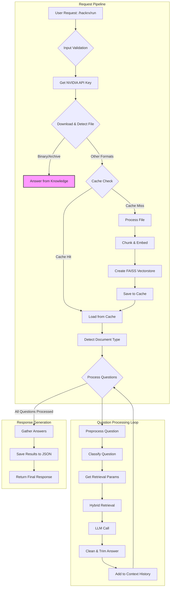

# Bajaj Policy MVP RAG

## API Endpoint Overview

This project exposes a FastAPI endpoint for advanced Retrieval-Augmented Generation (RAG) over insurance, academic, and legal documents.  
**Main endpoint:**  
- `POST /hackrx/run`  
  - Accepts:  
    - `documents`: URL to a document (PDF, PPT, DOCX, XLSX, image, etc.)
    - `questions`: List of questions to answer from the document
  - Returns:  
    - Answers for each question, leveraging embeddings, hybrid retrieval, and NVIDIA LLM.

Other endpoints:
- `GET /health` — Health check
- `GET /cache/stats` — Cache statistics
- `DELETE /cache/clear` — Clear embedding cache

## Workflow



## Frontend MVP

The MVP frontend is built with React (see `frontend/`).  
- Features a dashboard, chat bar, sidebar, and metric cards.
- Uses Tailwind CSS for styling.
- Connects to the API endpoint for document Q&A.
- Designed for rapid prototyping and user feedback.

## Product Screenshot


## How to Start

**Backend (API):**
```bash
# Install dependencies
pip install -r requirements.txt

# Run the FastAPI server (with ngrok for public URL)
python api_main_v2.py
```

**Frontend:**
```bash
cd frontend
npm install
npm start
```

Access the frontend at [http://localhost:3000](http://localhost:3000) and connect to the API endpoint as configured.

## Tech Stack

- FastAPI, Python, LangChain, HuggingFace Embeddings, FAISS, NVIDIA LLM
- React, Tailwind CSS (frontend)
- Advanced caching, multi-format document loaders, hybrid retrieval

## License

MIT
